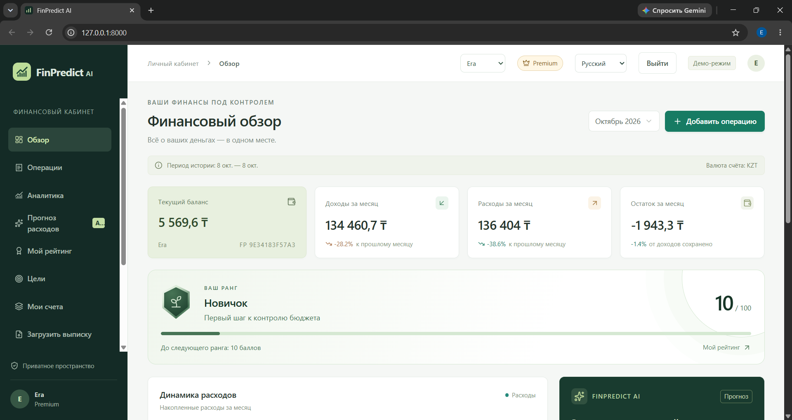
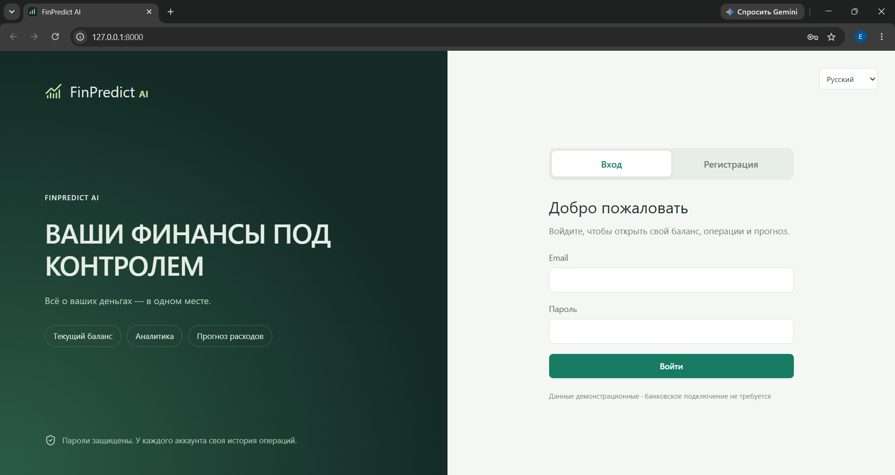
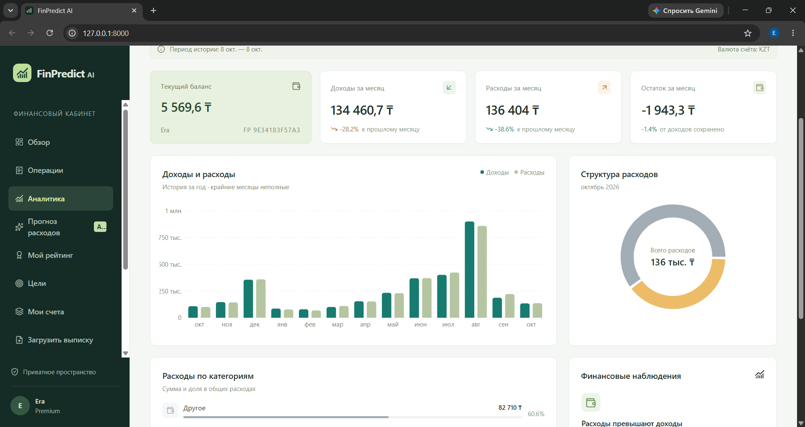

# FinPredict AI — multi-user bank expense forecasting demo

**1000 synthetic customers, administrator, ranks, goals, Kaspi Gold PDF / CSV / XLSX import and demo Premium; RU / KK / EN.**

Version 0.4.2 adds direct Kaspi Gold original-PDF import. Preview and confirm on an
empty account: original dates and opening balance are retained, transaction totals
are reconciled against the bank summary, repeated rows are skipped. Subsequent
statements must be from the same account and reconcile with the existing ledger.
The PDF itself and raw bank account number are not stored. Transfers/refunds are
cash movements, not earnings; purchase categories are provisional. The synthetic
ML model remains a demonstration, not validated advice for real customers.

Run `START_WINDOWS.bat` on Windows after configuring `backend/config.py`.
Instructions and login details: **START_HERE_RU.txt**.
Existing installation: **UPDATE_HERE_RU.txt** and `UPDATE_WINDOWS.ps1`.
Python + MS SQL via pyodbc; completed frontend in `dist-mssql`.

On the first terminal launch, `python backend/app.py` initializes the schema,
imports customers and asks for locally chosen admin and demonstration passwords.
Admin email: `admin@finpredict.local`. Customer emails: `client0001@example.test`
through `client1000@example.test`. Repeat startup preserves existing records.
For WSGI deployment, run `python backend/init_demo.py` before starting WSGI.

## Data and access

History: 2025-10-08 to 2026-10-07. Forecast: next 30/60/90/180/365 days.
Generated profiles contain name, fake email, city, age, occupation, segment,
monthly income, account and historical transactions. All data is synthetic.
Admins can search and view every customer's profile, history and forecast.
Customers can access only their own accounts; registrations always have user role.
Passwords use scrypt hashes. Sessions are signed and backed by revocable server
records; changes require CSRF tokens. Session cookies are HttpOnly, SameSite=Lax;
set FINPREDICT_COOKIE_SECURE=yes for HTTPS-only serving.

Schema adds `Role` to Users and creates UserProfiles. Existing users remain
customers; an existing customer's email cannot be elevated by the setup script.
No existing database, account or transactions are dropped. Admin access is read-only.

## ML

Bundled HistGradientBoostingRegressor, scikit-learn 1.8.0. Features: prior monthly
variable expenses, causal rolling averages and month seasonality. Training ends
in August 2026, with September 2026 held out for validation (7000 / 1000 examples).
Regular income and payments are accounted for separately. Annual forecasts use
recursive monthly estimates; annual forecast accuracy has not been validated.
Validation metrics describe synthetic, one-month forecasts only. The displayed
uncertainty band is illustrative and widens for longer horizons.

- `backend/generate_dataset.py`: reproducible profile/transaction generation.
- `backend/data/clients_1000.jsonl.gz`: complete generated import dataset.
- `backend/init_demo.py`: repeat-safe import and administrator setup.
- `backend/train_model.py`: chronological training and holdout metrics.
- `backend/model/expenses.joblib`: bundled trained model.
- `backend/model/metrics.json`: measured validation metrics.
- `mssql-web/admin.tsx`: administrator dashboard.

## Development and validation

```text
python -m pip install -r backend/requirements.txt
python backend/app.py
pnpm install
pnpm run build:mssql
python tests/test_club.py
python tests/test_admin.py
python tests/test_init_db.py
python tests/test_finance.py
node tests/check_languages.mjs
node tests/check_member_ui.mjs
node tests/check_csrf.mjs
node node_modules/typescript/bin/tsc --noEmit
```

HTTP and full import tests use an in-memory SQL adapter. Bootstrap uses an ODBC
test double. A live SQL Server and browser QA were unavailable here.
The previous hosted D1/Workers site is unchanged; this package targets local Python/MS SQL.
Forecast evaluation approach: https://scikit-learn.org/stable/auto_examples/applications/plot_time_series_lagged_features.html

## Club / Premium (0.4.0)

Novice → Practitioner → Strategist → Capitalist → Magnate, with five metallic
badge styles. A transparent demo score combines buffer (40), savings ratio (35),
and budget stability (25); subscription status never affects the score.
Admin-only leaderboard aggregates all accounts, supports rank filters and paging.
Client inspection includes all owned accounts, goals and subscription status.

Basic: one account, three goals, all existing forecasting features and imports.
Demo Premium: 1990 KZT per calendar month, three total accounts, twenty goals,
side-by-side 90-day scenario comparison, and CSV transaction export. New accounts
start empty at zero balance. Server enforces entitlements and ownership.
Expiration/cancellation keeps all existing accounts, history and goals accessible.
Goals are manual savings tracking; updating one does not move money.

**There is no live checkout or real charging.** Users explicitly confirm a demo
activation. No auto-renewal. The demo can be cancelled immediately. A real
payment provider and verified server-side payment webhooks are needed for sales.

Statement import supports bounded CSV/XLSX with server-side validation, preview
and a separate confirmed commit. Preview is user/account-bound and expires after
30 minutes. Any invalid row rejects the file before writes. Deterministic IDs
skip repeated imports while preserving identical rows within a statement.
Supported columns and dates are documented in UPDATE_HERE_RU.txt. Demo history
remains 2025-10-08 through 2026-10-07; forecasts start the following day.
Files are limited to 2 MB, 3000 transactions and 20 columns; XLSX expansion is
bounded and formulas are not evaluated. CSV exports neutralize formula prefixes.

Migration adds UserAccounts, Subscriptions, Goals and StatementPreviews and
backfills primary account ownership without dropping data. Registration/import
primary accounts remain compatible via the Users.AccountId relation.
Membership handlers: backend/club.py; scoring: backend/ranks.py; statement parser:
backend/statements.py; UI: mssql-web/member.tsx and ranking.tsx; styles: app/club.css.
The new requirement openpyxl is installed by START_WINDOWS.bat.

## Registration correction (0.4.1)

New registrations start with Opening=0 and no transactions. Only the 1000
explicitly imported synthetic demo clients have prepopulated annual histories.
Reading a dashboard or adding an operation never auto-seeds an account. Demo
reset is allowed only for an imported demo client's primary account; the reset
button is hidden for ordinary clients. Existing histories are preserved.

## Скриншоты

### Главная страница


### Вход


### Личный кабинет

